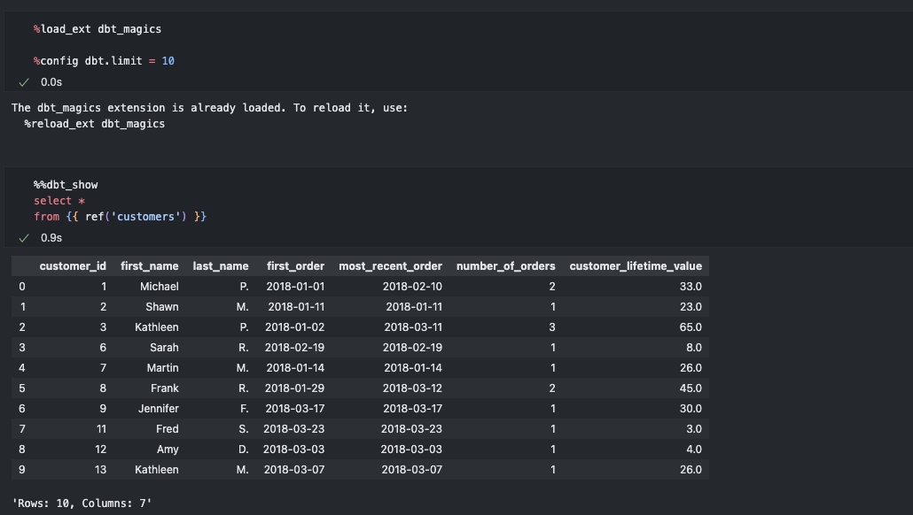

# dbt-magics

## Overview

`dbt-magics` is a custom magic command set for dbt　that allows you to easily operate dbt within Jupyter Notebooks. It enables direct compilation, execution, and manipulation of dbt models and SQL code, streamlining the data analysis workflow.



## Installation

```sh
pip install git+https://github.com/1210yuichi0/dbt-magics.git
```

1. Import and register the magic commands in your Jupyter Notebook:

   ```python
   %load_ext dbt_magics
   ```

2. Start using the `%config` line magic and the `%%dbt_show` / `%%dbt_compile` cell magics.

If needed, configure pandas display settings:

```python
import pandas as pd
pd.set_option('display.max_rows', None)  # Remove the upper limit for the number of rows displayed
pd.set_option('display.max_columns', None)  # Remove the upper limit for the number of columns displayed
```

## Usage

### Configuration

Use the `%config` line magic to set global configurations. You can set the following parameters as needed:

```python
%config dbt.limit = 50  # Set the row limit for the `show` command (default: 50)
%config dbt.quiet = True  # Set the output verbosity (default: true)
%config dbt.project_dir='/path/to/project'　# Set the project directory (default: None)
%config dbt.profiles_dir='/path/to/project'  # Set the profiles directory (default: None)
%config dbt.target='dev'  # Set the target environment (default: None)
%config dbt.dbt_profiles_dir='/path/to/project'  # Set the DBT_PROFILES_DIR environment variable
```

### Commands

#### `%%dbt_show`

Execute the `show` command to preview the results of a SQL model or query:

```sql
%%dbt_show [copydf | variable_name]
SELECT * FROM {{ ref('my_model') }}
```

Options:

- `copydf`: Copies the resulting DataFrame to the clipboard.
- `variable_name`: Saves the resulting DataFrame under the specified variable name.

#### `%%dbt_compile`

Execute the `compile` command to display the transformed SQL code:

```sql
%%dbt_compile
SELECT * FROM {{ ref('my_model') }}
```

The transformed SQL is displayed as a collapsible section.